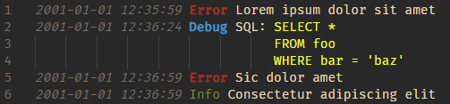
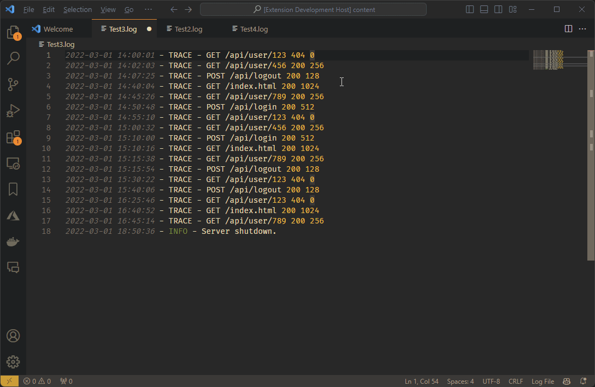
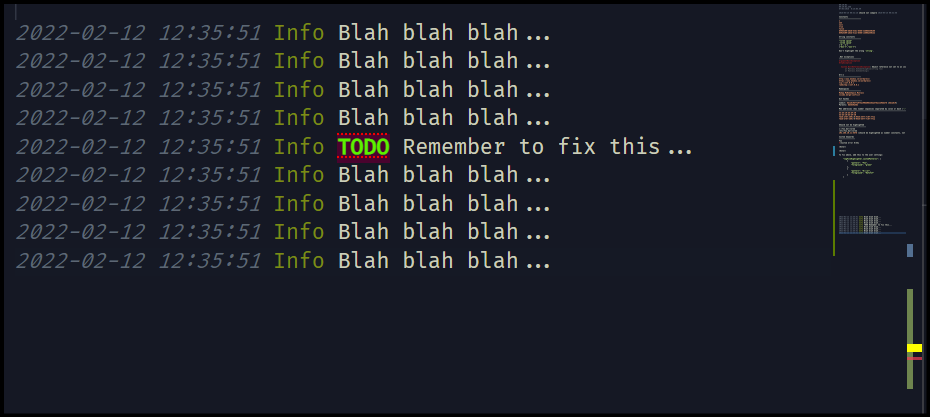

# Change Log

### 3.3.1 - 17 August 2024

* Bug fix for tail mode. It could throw an exception in some cases that was logged to the extension host. No visible problem but unnecessary nonetheless. Fixes #613.

### 3.3.0 - 19 July 2024

**New feature**

* Added support for microsecond precision for timestamps.

  Example timestamp: `2023-09-26 18:24:17.035169`

  Before this change, only millisecond precision was supported, so the last three digits in the timestamp above were lost. This was caused by limited time precision support in Javascript and microsecond precision has required explicit handling in the extension to keep track of the number of microseconds.

  Fixes #65 and #594.

### 3.2.0 - 30 June 2024

**New features**

* There is now a new **tail mode** feature that is automatically activated by scrolling to the end of a log file. When active, a message will be shown in the status bar: `Log File Tail Mode`. To deactivate, simply scroll up. Fixes feature request #21.

  To disable this feature altogether, set the `logFileHighlighter.enableTailMode` setting to `false`.

* Custom patterns can now be set to **highlight the entire line** where a match is found. This is done by setting the `highlightEntireLine` setting to `true`. Fixes feature request #535.

**Bug fixes**

* Also fixed multiple bugs with custom patterns that occurred when a log file was modified, either externally (new log lines being added at the end) or interactive editing of log files (which is an edge case for sure, as log files are generally not modified). The issue was out-of-sync pattern positions.

### 3.1.0 - 22 June 2024

**New feature**

* There is now a new option for modifying the behavior of custom patterns, the **patternFlags** setting. This setting allows for the use of regular expression flags such as "i" for case-insensitive matching or "s" for multiline matching. Fixes feature requests #87 and #276.

  Example:
  


### 3.0.3 - 22 June 2024

**Bug fixes**

* Time progress indicator: Add condition to the Escape key binding so it only applies when there are rendered progress indicators. This should fix issue #588 where the key event is not propagated to the Vim VS Code extension, even when no log file operation is performed.

### 3.0.2 - 21 June 2024

**Bug fixes**
* Time progress indicator: Make sure initialization is done faster when starting VS Code.
* Time progress indicator: Improve handling of empty lines
  * We now use the first and last non-empty lines for the time progress indicator rather than not showing the indicator if any of them were empty or do not contain a timestamp.
  
### 3.0.1 - 20 June 2024

**Bug fixes**
* Change the Escape key binding to only apply to log files. Partly fixes issue #588 where the key binding seems to conflict with the Vim VS Code extension.

### 3.0.0 - 19 June 2024

**Breaking change**
* Remove special handling of custom patterns that are not regular expressions
  * Before, if the pattern contained nothing but alphanumeric characters, it was treated in a special way. It was colored only if not followed by a right square bracket or a colon. This is now removed, which might cause some existing patterns to be applied on more places than before. Fixes issue #366.

**New feature**
* A **time progress indicator** is now added to the selected lines when two or more lines are selected. The progress indicator gives a visual representation of each line's point in time within the selection.
  * The color of the progress indicator can be customized using the `logFileHighlighter.progressIndicatorUnderlineColor` setting. The default color is `#00ff1f8f`.
  * The feature can be disabled using the `logFileHighlighter.enableProgressIndicator` setting.

  * Example of the progress indicator in action:
  

**Other changes**
* Updated package dependencies

### 2.19.0 - 9 May 2024

* Updated package dependencies

### 2.18.0 - 19 Feb 2024

* Adjusted coloring pattern for .Net exception stack traces to avoid accidental coloring of words that starts with "at" (thanks @ShawnZhong!)

* Updated package dependencies

### 2.17.0 - 19 Nov 2023

* Updated package dependencies

### 2.16.0 - 9 Jun 2022

* Added coloring of hexadecimal constants such as `0xE2`

* Updated package dependencies

### 2.15.0 - 12 Feb 2022

* Added new text decoration options for custom patterns:

  * fontWeight
  * fontStyle
  * border
  * borderRadius
  * letterSpacing
  * overviewColor
  * overviewRulerLane
  * textDecoration

  These allow for considerably more customization for the matched text.

  Example that uses the new settings:

  ```json
  {
      "pattern": "(todo|TODO)",
      "foreground": "#34f10e",
      "background": "#4d042e",
      "fontWeight": "bold",
      "overviewColor": "red",
      "overviewRulerLane": "Full",
      "textDecoration": "red underline overline dotted",
  }
  ```
  

### 2.14.0 - 29 Jan 2022

* Mainenance - package updates

### 2.13.0 - 12 Oct 2021

* Temporarily rolled back package updates to be the same as 2.11.0 since some kind of memory error seems to have appeared with custom patterns (issue #286).

### 2.12.0 - 7 Oct 2021

* Maintenance release with lots of package updates

### 2.11.0 - 23 Jan 2021

* Fixed the patterns for GUID strings and MAC addresses so that they only match when the characters are at word boundaries which helps to avoid accidental matches.

* Updated dependencies.

### 2.10.0 - 7 Nov 2020

* Changed the regex for URIs so that all schemes that matches `[a-z]*` are supported, rather than just `http`,`https`, `ftp`, and `file`.

* Added requirement for short dates that they are preceded by whitespace or the beginning of a line to decrease the risk of unwanted highlighting in number sequences.

* Updated dependencies.

### 2.9.0 - 15 July 2020

* Added coloring of MAC addresses (hex numbers separated by colons or dashes (':', '-').
   * Example: `43:A4:19:A5:AF:C0`

* Added coloring of single-character log-levels: `V`, `D`, `I`, `W` and `E`
   * Coloring on happens if not other alphabetical characters precedes the log level on the lines.

* Updated dependencies.

### 2.8.0 - 10 April 2020

* Changed the format on the foreground and background color settings for custom patterns so that a color picker can be used to select the color.

* Added "workspace" extensionkind setting to enable the extension to work as a workspace extension.

* Updated some dependencies to fix security vulnerabilities.

### 2.7.1 - 11 Jan 2020

* Fixed a bug that caused the extension to crash on activation.

### 2.7.0 - 25 Dec 2019

* Changed the **Visualization of Time Duration** feature. Now it does not anymore require timestamps to be at the very beginning of a line. Instead the first occurrence of a timestamp in a line is used.

* Added Xorg levels `WW`, `II`  and `EE`. 

* Updated dependencies

### 2.6.0 - 26 Sep 2019

* Added the Android logcat log levels `/E`, `/W`, `/I`, `/D` and `/V` to the default patterns.

* Added the Serilog "Verbose" log level to the default patterns.

* Updated dependencies

### 2.5.0 - 17 May 2019

* New setting: **Background color for custom highlighting patterns**
  * Now in addition it is possible to add a `background` color for custom patterns.

* Compatibility fix for [Remote Development](https://code.visualstudio.com/blogs/2019/05/02/remote-development).

* Updated all dependencies to fix security vulnerabilities.

### 2.4.3 - 9 January 2019

* Updated all dependencies to fix security vulnerabilities in `event-stream` and `flatmap-stream`.

### 2.4.2 - 7 October 2018

* Adjusted time format regex to match single-digit hours and to not require 3 digits for the fraction of a second part.

* Fixed bug that the initial bracket was colored as a string quote in this example: ['a']

### 2.4.1 - 9 September 2018

* Exclude coloring of patterns that looks like namespaces (a non-whitespace character sequence with at least one dot) when surrounded by slash or backslash characters.

  Should stop coloring of `foo.bar` in cases like these:

  ```
  c:\foo.bar\lorem
  /etc/foo.bar/lorem
  ```

### 2.4.0 - 23 April 2018

* Added some levels based on Syslog severity levels such as `EMERGENCY`, `ALERT`, `CRITICAL`, and `NOTICE`. Contributed by Mulia Nasution.

### 2.3.0 - 21 April 2018

* Added NLog log levels: Fatal, Error, Warn, Info, Debug and Trace

* Fixed bug in the duration calculation feature so that it only looks for times and dates at the beginning of log lines.

### 2.2.0 - 15 April 2018

* Added CI builds in Travis (found [here](https://travis-ci.org/emilast/vscode-logfile-highlighter)) and a Travis badge in the Readme file.

* Added support for multiline expressions in the custom highlighting patterns feature. Allows the use of `^` and `$` for indicating the begin and end of lines respectively.

* Removed highlighting of file system paths. It was hard to define in a fool proof way and since there is no way to turn it off, it's better to let people add that highlighting using the custom highlighting patterns feature.

* Protected string constant matching from matching quotes in abbreviated phrases such as `don´t`,

### 2.1.1 - 15 Feb 2018

* Updated readme file:
  * Added a note about that an earlier version of the extension has now been incorporated into the standard Visual Studio Code installation.
  * Added an animated GIF showcasing the custom pattern highlighting feature.

### 2.1.0 - 14 Feb 2018

* New feature: **Custom highlighting patterns**
  * LogFileHighlighter can now be configured to add highlighting to user-specified patterns.
  * This can be used to adapt the extension to unsupported logging frameworks, to highlight domain specific patterns or just about anything else.
  * Feature contributed by Leo Hanisch ([@HaaLeo)](https://github.com/HaaLeo). Greatly appreciated, Leo!

* File system paths are now highlighted. Applies to both Windows-style paths (`C:\Windows`) and Unix-style (`/dev/null`).

* Added dash (`-`) to be allowed in "namespace" names. Makes text such as `vscode.merge-conflict` to be colored correctly.

### 2.0.0 - 6 Feb 2018

* New feature: **Visualization of Time Duration**
  * Select two or more lines and the time difference between the first and last log event is shown in the status bar.
  * Big thanks to Leo Hanisch ([@HaaLeo)](https://github.com/HaaLeo) for implementing this feature!

* Git hashes are now colored.

* Custom token for overriding exception types has changed from `log.type` to `log.exceptiontype`, which makes more sense.


### 1.2.0 - 19 Sep 2017

* New feature: Customization of colors that overrides the default (which is to reuse theme colors). Fixes issues #24 and #27.

### 1.1.1 - 11 Feb 2017

* Fixed bug that concatenated dates and times stopped being highlighted in version 1.1.0.

### 1.1.0 - 10 Feb 2017

* Added the Serilog log level abbreviations to the matched patterns. This means that `[eror]`, `[wrn]` etc are now correctly colored. (initiated and assisted by @Leon99).

* Added a few patterns that seem common in the Javascript world, such as `error:` and `warning:`.

* Adjusted the patterns for dates so that we highlight dates and clock times separately as suggested by @Leon99.

* Moved the extension back into the [Other section](https://marketplace.visualstudio.com/search?target=VSCode&category=Other) of the marketplace which seems to be the proper category after all...


### 1.0.1 - 1 Dec 2016

* Added a dot (`.`) as an allowed separator between seconds and milliseconds in datetime values, as suggested in [issue 12](https://github.com/emilast/vscode-logfile-highlighter/issues/12).

* Moved the extension into the new [Formatters section](https://marketplace.visualstudio.com/search?target=VSCode&category=Formatters) of the marketplace.

### 1.0.0 - 11 Sep 2016

* Fixed bug that GUIDs that start with a pure numerical digit sequences were not colored correctly. 

* Changed the Visual Studio Code version requirement to be at least `1.0.0` (rather than having an old pre-release requirement),
  which should fix some incompatibility problems with VS Code 1.6. 

### 0.9.0 - 23 Aug 2016

* Added highlighting of culture specific dates (fixes issue #8).
* Added highlighting of lower case GUIDs (fixes issue #7).

### 0.8.0 - 26 Jul 2016

* Added highlighting of time zone parts in dates (fixes issue #5).
* Added highlighting of GUIDs (fixes issue #6).

### 0.7.0 - 19 Apr 2016

* Adjusted the coloring for DEBUG, INFO, WARN, ERROR, constants, exceptions and stack traces to remain compatible with Visual Studio Code 1.0.

### 0.6.0 - 22 Feb 2016

* Added icon to Marketplace manifest.
* Added coloring of Url:s and namespaces.
* Changed the color of exception stack traces to be a little more discreet. 

### 0.5.11 - 29 Dec 2015

* A recent VS Code update caused exception call stacks to be uncolored for some reason. Changed so that they use the same color as the exception name.

### 0.5.10 - 16 Dec 2015

* Fixed bug that dates were colored the same way as constants.

### 0.5.9 - 15 Dec 2015

* Added coloring of **string constants** enclosed with single or double quotes.
* Added new constants `null`, `true` and `false`, colored the same way as numeric constants.


[sample]: https://raw.githubusercontent.com/emilast/vscode-logfile-highlighter/master/content/sample.png
