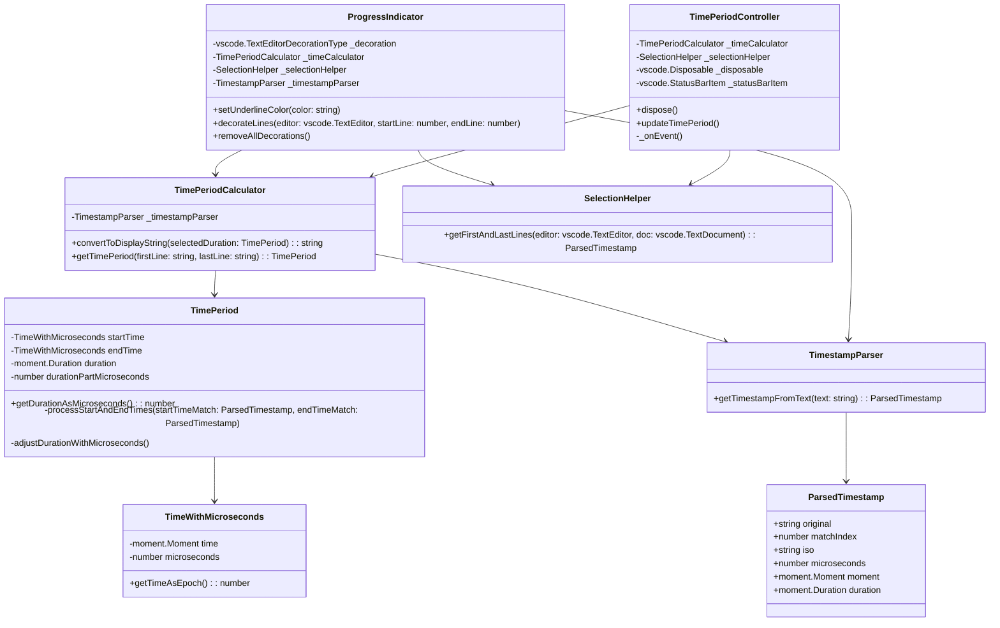

# Instructions for developers

## Build locally

```
npm install
npm run compile
```

## Test extension in new Code instance

1. Open the project folder in Code.
2. Choose **Debug/Start Debugging** or press <kbd>F5</kbd>.

## Run tests

### Unit tests

#### VsCode
1. <kbd>Ctrl</kbd> + <kbd>P</kbd>
2. type *Debug Unit Tests*
3. Press <kbd>Enter</kbd>

#### Command Prompt
Or start them after compiling the project via:
```
npm run unittest
```

### Integration tests
#### VsCode
1. <kbd>Ctrl</kbd> + <kbd>P</kbd>
2. type *Debug Integration Tests*
3. Press <kbd>Enter</kbd>

#### Command Prompt
Set the following environment variables on your system:
* `CODE_TESTS_PATH`: **Absolute path** to `out/test/integrationtest`
* `CODE_TESTS_WORKSPACE`: **Absolute path** to `test/integrationtest/testLogs`

Start the integration tests after compiling the project via running:
```
npm run integrationtest
```

# Class diagram


