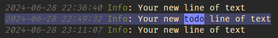

# Log File Highlighter


![alt text][sample]

## Description
A Visual Studio Code extension for adding color highlighting to log files. It is based on standard conventions for log4net log files but it's general enough to be useful for other variations of log files as well. The colors are customizable but by default the current color theme's colors are used.

### Open Source
This extension is open source under the MIT License and completely free but if you like it and want to encourage further development, then you might want to consider supporting it using one of the links below:

[](https://github.com/sponsors/emilast)

<a href="https://www.buymeacoffee.com/emilast" target="_blank"></a>

But that's completely optional, of course 😊

### Note
An earlier version of the syntax highlighting definition from this extension was included into Visual Studio Code [version 1.20](https://code.visualstudio.com/updates/v1_20#_output-panel). If the default behavior of log files in VS Code is good enough for you, then you don't need this extension. However, if you want additional highlighting, customizable patterns and time duration calculation and visualization, then keep reading :-)

## Features
### Syntax Highlighting
The extension associates with `.log` files and applies coloring to the different elements in the file, for example:

| Category                                         | Example                                                                                                                  |
| ------------------------------------------------ | ------------------------------------------------------------------------------------------------------------------------ |
| Dates and times in ISO format, such as           | `2015-12-09`, `2015-12-09 09:29`, `2015-12-09 09:29:02.258`                                                              |
| Dates and times in some culture-specific formats | `12/09/2016`, `12.09.2016`, `112-09-2016`, `12-09-2015 09:29`, `12-09-2015 09:29:02,258`                                 |
| Log level                                        | `DEBUG`, `INFO`, `INFORMATION`, `WARN`, `WARNING`, `ERROR`, `FAIL`, `FAILURE`                                            |
| Numeric constants                                | `1`, `234`                                                                                                               |
| Standard .Net constants                          | `null`, `true`, `false`                                                                                                  |
| String constants                                 | `"lorem ipsum"`, `'lorem ipsum'`                                                                                         |
| GUIDs                                            | `859A4209-A82D-4CA1-8468-C2606A3501EE`                                                                                   |
| MAC addresses                                    | `43:A4:19:A5:AF:C0`, `43-A4-19-A5-AF-C0`, `fde8:e767:269c:0:9425:3477:7c8f:7f1a`, `fde8-e767-269c-0-9425-3477-7c8f-7f1a` |
| .Net exception type names                        | `ArgumentNullException`, `HttpException`                                                                                 |
| .Net exception stack traces                      | Lines starting with whitespace characters, followed by `at`                                                              |
| Urls                                             | `http://www.meadow.se/wordpress/`                                                                                        |
| Namespaces                                       | `MyApp.MyNameSpace.MyClass`                                                                                              |

### Visualization of Time Duration and Progress
If you select multiple lines of a `.log` file, some simple timestamp analysis is performed.

* A status bar item is displayed that indicates how many days, hours, minutes, seconds and milliseconds that is selected.
* A progress bar is also drawn under the timestamps in the selection to give a visual representation of each line's point in time within the selection.
* Press <kbd>Escape</kbd> to clear the progress bars.

  

Settings

* **enableProgressIndicator** can be used to disable the progress indicator feature. The default value is `true`. Set it to `false` to disable the feature.

* **progressIndicatorUnderlineColor** can be used to set the color of the progress indicator. The default value is `#00ff1f8f`. Note the alpha channel value at the end of the color value (`8f`). This can be used to make the color semi-transparent for mixing with the background color.

Example:
```JSON
"logFileHighlighter.enableProgressIndicator": true,
"logFileHighlighter.progressIndicatorUnderlineColor": "#ffee00",
```

### Tail Mode

The extension also supports a tail mode where the end of the log file is kept in view as new lines are added. To activate it, scroll to the end of the log file until a message is shown in the status bar: `Log File Tail Mode`

To deactivate tail mode for the current file, scroll up again.

This feature can be disabled by setting the `logFileHighlighter.enableTailMode` setting to `false`.

## Customization

### Customizing the colors

By default, this extension reuses existing theme colors in order to adapt to the user's preferences. Sometimes this will result in colors that may not make complete sense in the log file context (for example `ERROR` might be green and `DEBUG` red, when it would be more appropriate to have it the other way around).

For this reason, the extension defines a special set of grammar tokens that can be used to override the colors of the default log items:

```
log.constant
log.date
log.debug
log.error
log.exception
log.exceptiontype
log.info
log.string
log.verbose
log.warning
```

To override the color for one of these, use the `editor.tokenColorCustomizations` user setting, which was introduced in Visual Studio Code 1.15. Here's an example that forces errors to be red and bold and warnings to be orange, regardless of what color theme is used:

```JSON
"editor.tokenColorCustomizations": {
    "textMateRules": [
        {
            "scope": "log.error",
            "settings": {
                "foreground": "#af1f1f",
                "fontStyle": "bold"
            }
        },
        {
            "scope": "log.warning",
            "settings": {
                "foreground": "#f4ad42",
                "fontStyle": ""
            }
        }
    ]
}
```

### Defining custom highlighting patterns

The extension also supports defining custom patterns to be highlighted. This can be useful to make the extension compatible with the log levels of an otherwise unsupported logging framework or to highlight domain specific patterns, or just about anything else.

The patterns are defined in the user settings like in this example:


```JSON
"logFileHighlighter.customPatterns": [
    // Highlight the text 'Verbose' with green color
    {
        "pattern": "Verbose",
        "foreground": "#22aa22"
    },
    // Highlight the text 'E/' and any immediately following word constitient characters with red foreground and yellow background
    {
        "pattern": "E/\\w+",
        "foreground": "#af1f1f",
        "background": "#f3f38d"
    },
    // Highlight anything between square brackets with dark grey background
    {
        "pattern": "\\[(.*?)\\]",
        "background": "#333333"
    },
    // Highlight ERROR if surrounded by double quotes using positive lookbehind and lookahead expressions
    {
        "pattern": "(?<=\")ERROR(?=\")",
        "foreground": "#00FF00",
    }
]
```

| Setting               | Optional  | Description                                                                                                                                                                                      | Examples                                                                          |
| --------------------- | --------- | ------------------------------------------------------------------------------------------------------------------------------------------------------------------------------------------------ | --------------------------------------------------------------------------------- |
| `pattern`             | Mandatory | The matching expression.This can be either a string constant or a JavaScript regular expression (remember to **escape special characters**).                                                     | `foobar`, `(TODO)`                                                                |
| `patternFlags`        | Optional  | Flags to use with the regular expression, in addition to the `gm` flags that are set by default.                                                                                                 | `i` (case insensitive)<br>`is` (case insensitive + '.' matches newline characters |
| `highlightEntireLine` | Optional  | If true, then the entire line where match is found is highlighted.                                                                                                                               | `false` (default), `true`                                                         |
| `foreground`          | Optional  | The color to use as foreground color for the matched pattern. Hex colors are preferred since they can be selected with the VS Code color picker but predefined VS Code color names work as well. | `yellow`, `#ff5588`                                                               |
| `background`          | Optional  | The color to use as background color for the matched pattern.                                                                                                                                    | `yellow`, `#ff5588`                                                               |
| `fontWeight`          | Optional  | Used to change the weight of the font.                                                                                                                                                           | `bold`                                                                            |
| `fontStyle`           | Optional  | Used to change the style of the font.                                                                                                                                                            | `italic`                                                                          |
| `border`              | Optional  | Can be used for adding a border around matched text.                                                                                                                                             | `2px solid yellow`                                                                |
| `borderRadius`        | Optional  | Can be used together with the `border` setting to make the border corners rounded.                                                                                                               | `3px`                                                                             |
| `letterSpacing`       | Optional  | Can be used to increase or decrease the horizontsl spacing between characters in the matched text.                                                                                               | `5px` <br> `-1px`                                                                 |
| `overviewColor`       | Optional  | If set, this enables matched text to be indicated in the overview ruler to the right of the text editor window in Code.                                                                          | `yellow`, `#ff5588`                                                               |
| `overviewRulerLane`   | Optional  | If `overviewColor` is set, then this setting controls the placement of the marker in the ruler.                                                                                                  | `Left`, `Right`, `Center`, `Full`                                                 |
| `textDecoration`      | Optional  | Used for adding additional CSS text decorations.                                                                                                                                                 | `red underline overline dotted`, `red wavy underline`                             |


**Note**: Both `foreground` and `background` are optional individually but *at least* one of them must be set for the custom pattern to be activated.

  


## Tips

### File associations

To make VS Code treat other file extensions than the default `.log` as log files, add the following to the user settings:

```json
"files.associations": {
    "*.log.*": "log"
},
```
The example above associates extensions such as `.log.1` and `.log.2` with the Log File highlighter extension.

### Custom pattern tips

#### Multiple styles for the same pattern

The same pattern can be used in multiple style configurations, which can be useful if you want to highlight the same pattern in different ways. Example:
```json
{
    "pattern": "todo",
    "patternFlags": "i",
    "foreground": "#000000",
    "background": "#7d8aff",
},
{
    "pattern": "todo",
    "patternFlags": "i",
    "highlightEntireLine": true,
    "background": "#7d8aff50",
},
```

  

#### Case sensitivity

The custom patterns are case sensitive by default. To make a pattern case-insensitive, set **patternFlags** to "i".

Here's and example that matches both "todo" and "TODO":

```json
{
    "pattern": "todo",
    "patternFlags": "i",
    "foreground": "#ff0000"
},
```

#### Multiline custom patterns

The custom patterns can be multiline patterns. This can be useful for example when you want to highlight SQL statements, stack traces, etc. To match multiple lines, use the `s` flag in the **patternFlags** setting. This flag makes the `.` character match newline characters as well. Here is an example that highlights SQL statements:

```json
{
    "pattern": "SELECT.*?FROM.*?WHERE.*?$",
    "patternFlags": "si",
    "foreground": "#eeff05",
},
```

Notes:
* The **patternFlags** setting is used to set the `s` flag which makes the `.` character match newline characters (and `i` for case insensitivity).
* The **pattern** uses `?` after the `*` quantifier to make the match **non-greedy**. This is important to make the pattern match only one SQL statement at a time and not extend to the next `WHERE` clause of a later log entry.

Result:


### Syntax highlighting of large files

VS Code disables color highlighting for large files by default. This can be disabled with the **editor.largeFileOptimization** setting. To enable highlighting for large log files without changing the setting for other file types, place it in the `[log]` scope like this:

```json
"[log]": {
    "editor.largeFileOptimizations": false,
}
```

[sample]: https://raw.githubusercontent.com/emilast/vscode-logfile-highlighter/master/content/sample.png
