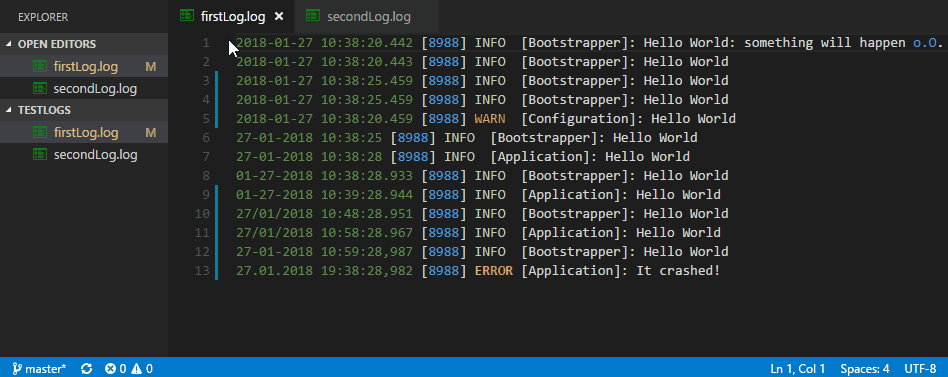

# Log File Highlighter

[](https://raw.githubusercontent.com/emilast/vscode-logfile-highlighter/master/LICENSE) [](https://marketplace.visualstudio.com/items?itemName=emilast.LogFileHighlighter) [](https://marketplace.visualstudio.com/items?itemName=emilast.LogFileHighlighter) [](https://marketplace.visualstudio.com/items?itemName=emilast.LogFileHighlighter)

![alt text][sample]

## Description
A Visual Studio Code extension for adding color highlighting to log files. It is based on standard conventions for log4net log files but it's general enough to be useful for other variations of log files as well. The colors are customizable but by default the current color theme's colors are used.

## Features
### Syntax Highlighting
The extension associates with `.log` files and applies coloring to the different elements in the file, for example:

* Dates and times in ISO format, such as
    * `2015-12-09`
    * `2015-12-09 09:29`
    * `2015-12-09 09:29:02.258`
* Dates and times in some culture specific formats
    * `12/09/2016`
    * `12.09.2016`
    * `12-09-2016`
    * `12-09-2015 09:29`
    * `12-09-2015 09:29:02,258`
* Log level, such as
    * `DEBUG`
    * `INFO`, `INFORMATION`
    * `WARN`, `WARNING`
    * `ERROR`, `FAIL`, `FAILURE`
* Numeric constants, such as
    * `1`
    * `234`
* Standard .Net constants
    * `null`
    * `true`
    * `false`
* String constants, enclosed in single or double quotes. Examples:
    * `"lorem ipsum"`
    * `'lorem ipsum'`
* GUIDs. Example:
    * `859A4209-A82D-4CA1-8468-C2606A3501EE`
* .Net exception type names, i.e. word ending with `Exception`, such as
    * `ArgumentNullException`
    * `HttpException`
* .Net exception stack traces, i.e. lines starting with whitespace characters, followed by `at`, for example:
    ```
    System.NullReferenceException: Object reference not set to an instance of an object.
        at MyClass.DoSomethingElse(string foo)
        at MyClass.DoSomething()
    ```
* Url:s
    * `http://www.meadow.se/wordpress/`
* Namespaces (sequences of alphanumeric and dot characters). Useful to identity namespace qualified type names, for example.
    * `MyApp.MyNameSpace.MyClass`

### Visualization of Time Duration
If you select multiple lines of a `.log` file,
a status bar item is displayed that indicates how many days, hours, minutes, seconds and milliseconds you have selected.
  

## Customization

### Customizing the colors

By default, this extension reuses existing theme colors in order to adapt to the user's preferences. Sometimes this will result in colors that may not make complete sense in the log file context (for example `ERROR` might be green and `DEBUG` red, when it would be more appropriate tp have it the other way around).

For this reason, the extension defines a special set of grammar tokens that can be used to override the default colors:

```
log.constant
log.date
log.debug
log.error
log.exception
log.info
log.string
log.exceptiontype
log.warning
```

To override the color for one of these, use the `editor.tokenColorCustomizations` user setting, which was introduced in Visual Studio Code 1.15. Here's an example that forces errors to be red and bold and warnings to be orange, regardless of what color theme is used:

```
"editor.tokenColorCustomizations": {
    "textMateRules": [
        {
            "scope": "log.error",
            "settings": {
                "foreground": "#af1f1f",
                "fontStyle": "bold"
            }
        },
        {
            "scope": "log.warning",
            "settings": {
                "foreground": "#f4ad42",
                "fontStyle": ""
            }
        }
    ]
}
```

### File associations

To make VS Code treat other file extensions than the default `.log` as log files, add the following to the user settings:

```
"files.associations": {
    "*.log.*": "log"
},
```
The example above associates extensions such as `.log.1` and `.log.2` with the Log File highlighter extension.


[sample]: https://raw.githubusercontent.com/emilast/vscode-logfile-highlighter/master/content/sample.png